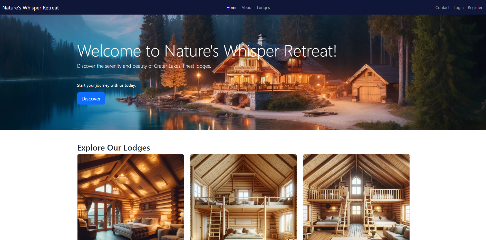

# Nature's Whisper Retreat

Welcome to Nature's Whisper Retreat, offering a serene and intuitive booking experience for those seeking tranquil lodge accommodations in the breathtaking Crater Lakes region. This platform serves as a bridge connecting nature enthusiasts with a variety of lodge options, each offering a unique blend of comfort, nature, and tranquility.

The live site can be viewed [here](https://natures-whisper-retreat-e1d73838d5e5.herokuapp.com/).

## Overview

Nature's Whisper Retreat aims to provide a seamless and user-friendly platform for users to explore, book, and manage their stays at various lodges located in the pristine Crater Lakes area. Whether you're seeking a quiet weekend getaway or an extended stay amidst nature, our platform caters to a diverse range of preferences and needs.

The application incorporates a range of features designed to ensure a comprehensive and enjoyable user experience, from an intuitive reservation calendar to secure user authentication and dynamic pricing based on seasonality and demand.

## Table of Contents
- [Nature's Whisper Retreat](#natures-whisper-retreat)
  - [Overview](#overview)
  - [Table of Contents](#table-of-contents)
  - [Features](#features)
    - [**Landing / Home Page**:](#landing--home-page)
    - [**Header**:](#header)
    - [**Lodge Overview**:](#lodge-overview)
    - [**Footer**:](#footer)
    - [**About Page**:](#about-page)
    - [**Lodge Detail Page**:](#lodge-detail-page)
    - [**Contact Form**:](#contact-form)
    - [**Login / Register**:](#login--register)
    - [**User Dashboard**:](#user-dashboard)
    - [**Booking and Reservations**:](#booking-and-reservations)
    - [**Admin Dashboard**:](#admin-dashboard)
    - [Admin Lodge Overview Management:](#admin-lodge-overview-management)
    - [Admin Lodge CRUD:](#admin-lodge-crud)
      - [Admin Add Lodge Page:](#admin-add-lodge-page)
      - [Admin Edit Lodge Page:](#admin-edit-lodge-page)
    - [Profile Page:](#profile-page)
    - [**404 Page**:](#404-page)
    - [**Responsive Design**:](#responsive-design)
    - [**Lodge Management**:](#lodge-management)
    - [**User Authentication**:](#user-authentication)
    - [**Dynamic Pricing**:](#dynamic-pricing)
    - [**Favicon**:](#favicon)
    - [**Error Handling**:](#error-handling)
    - [**Database Integration**:](#database-integration)
    - [**User Roles**:](#user-roles)
    - [**Inviting Design**:](#inviting-design)
    - [**User Friendliness**:](#user-friendliness)
  - [Future Developments](#future-developments)
    - [**Upcoming Features**:](#upcoming-features)
  - [User Experience](#user-experience)
    - [Epics](#epics)
    - [User Stories](#user-stories)
    - [Site Structure](#site-structure)
      - [Design and Wireframes](#design-and-wireframes)
      - [Home Page:](#home-page)
      - [About Page:](#about-page-1)
      - [Lodge Detail Page:](#lodge-detail-page-1)
      - [Reservation Page:](#reservation-page)
      - [Contact Form:](#contact-form-1)
    - [Login / Register Page:](#login--register-page)
      - [User Account Dashboard:](#user-account-dashboard)
      - [Admin Dashboard:](#admin-dashboard-1)
      - [Booking Flow:](#booking-flow)
  - [Database Schema](#database-schema)
  - [Technologies Used](#technologies-used)
    - [Languages](#languages)
    - [Frameworks](#frameworks)
    - [Libraries](#libraries)
    - [Database](#database)
    - [Tools \& Others](#tools--others)
  - [Testing](#testing)
    - [Manual Testing](#manual-testing)
    - [Lighthouse Reports](#lighthouse-reports)
    - [JavaScript Linting](#javascript-linting)
    - [Python Linting](#python-linting)
    - [HTML Validation](#html-validation)
    - [CSS Validation](#css-validation)
  - [Bugs](#bugs)
    - [Resolved Bugs](#resolved-bugs)
    - [Known Bugs](#known-bugs)
  - [Deployment](#deployment)
    - [Forking the GitHub Repository](#forking-the-github-repository)
    - [Cloning the GitHub Repository](#cloning-the-github-repository)
    - [Cloudinary Setup](#cloudinary-setup)
    - [ElephantSQL Setup](#elephantsql-setup)
    - [Heroku Deployment](#heroku-deployment)
  - [Credits](#credits)
    - [Content](#content)
    - [Code](#code)
    - [Media](#media)
    - [Acknowledgements](#acknowledgements)

## Features

### **Landing / Home Page**:
A visually appealing landing page showcasing the beauty and tranquility of the Crater Lakes region, inviting users to explore the site and book their stay.

From the landing page, users can navigate to the About page, view lodges, make reservations, contact Nature's Whisper Retreat, and login or register for an account.

   

### **Header**:
A consistent header design across all pages, providing easy navigation and access to key site features. Navigation links include Home, About, Lodges, Contact, and Login / Register.

   

### **Lodge Overview**:
A brief overview of the top 3 lodges, providing a glimpse of the available lodges and prompting users to explore further by booking their stay or contacting Nature's Whisper Retreat.
  
   

### **Footer**:
A consistent footer design with important information including contact details, social media links, and location.

   

### **About Page**:
A detailed page providing information about Nature's Whisper Retreat, and the features and activities available to guests.

   

   

   

### **Lodge Detail Page**:
Individual sections for each lodge, showcasing descriptions, amenities, pricing, and a reservation button.

- Hearthwood Haven:

   

- Sections & Reservation Button:

   Each lodge is separated by a line to provide a clear distinction between the lodges. A reservation button is available for each lodge, allowing users to book their stay directly from the detail page.

   

- The Adventurers' Alcove:

   

- The Nestling Nook:

   

### **Contact Form**:
A user-friendly contact form for general enquiries and feedback, allowing users to reach out to Nature's Whisper Retreat with ease.

Users are required to fill in their name, email, select a category, and provide a message before submitting the form.

Upon submission, the user is notified that their message has been sent successfully.

   

### **Login / Register**:
Users are able to login or register for an account to access personalized features, including booking management and reservation history.

- Login Page:

  Users are prompted to enter their username and password to log in to their account. If the user does not have an account, they can click on the "Sign Up" link to register.

   

- Register Page:
  
   Users are prompted to enter their email, username, and password to create an account. Upon successful registration, users are redirected to the login page to access their account.

  Should users already have an account, they can click on the "Sign In" link to access their account.

   

### **User Dashboard**:
A personalized dashboard for users to manage bookings, view and manage queries and view reservation history.

- Logged In Guest Header:
   
   Once a user is logged in, they can access their dashboard by clicking on the "My Bookings & Queries" link.

   

- User Dashboard:
   
   The user dashboard displays the user's booking history, including the lodge name and reservation dates, along with any submitted queries.

   

- Booking Dropdown:
   
   Users can view their booking details by clicking on the dropdown arrow, which expands to show the lodge name, reservation dates and booking status.

   

- View Booking Details:
   
   By clicking on the booking in the dropdown, users can view additional details, including the lodge name, dates, status and booking total.

   

- Booking Confirmation:
   
   Users can confirm their bookings by clicking on the reservation and confirming the booking as long as it is more than 24 hours before the reservation date. A confirmation message is displayed, and the user is returned to the user dashboard.
   ALternatively, users can contact Nature's Whisper Retreat for assistance.

   

- Booking Cancellation:
   
   Users can cancel their bookings by clicking on the reservation and confirming the cancellation as long as it is more than 24 hours before the reservation date. A confirmation message is displayed, and the user is returned to the user dashboard.
   ALternatively, users can contact Nature's Whisper Retreat for assistance.

   

- Bookings Within 24 Hours:
   
   If a user attempts to make changed to a booking within 24 hours of the reservation date, they will receive an message prompting them to contact Nature's Whisper Retreat for assistance.

   

- Queries:
      
   Full CRUD functionality has been implemented for user queries. Users are able to create queries through the contact form, view their queries, edit their queries and delete their queries.
   
   Users can view their submitted queries, including the category and message. Users are presented with the query details along with buttons to view or delete the query.
   
   

   Queries can be viewed by clicking on the query in the dropdown, which opens to show the user's name, email, category, message, status and lodge reply.

   

   

### **Booking and Reservations**:
An intuitive booking engine, allowing users to reserve their preferred lodges based on real-time availability.

- Sign In:
  
  By navigating to the Lodges page, users can click the reservation button and are prompted to sign in to their account to make a reservation. If they do not have an account, they can register for one.

- Reservation Calendar:
  
  Users can select their desired check-in and check-out dates using the interactive calendar, which displays available dates as well as greyed-out past dates and any unavailable dates.

  

  Typing in the dates manually has been disabled to prevent users from booking past dates or entering invalid information.

  If users attempt to book a lodge for unavailable dates or dates that overlap with existing bookings, an error message is displayed, prompting users to select alternative dates.

- Booking Confirmation:
   
   Once users select their check-in and check-out dates, they can proceed to confirm their reservation by clicking the "Book Now" button. A confirmation message is displayed, and the user can confirm or cancel the booking.
   
    

- Booking Cancellation:

   Users can cancel their bookings by clicking the 'Cancel Reservation' button. A confirmation message is displayed, and the user is returned to the dashboard.

   From here, users can see the booking status has been updated to 'Cancelled'.

   

- Pending Bookings:

   If a user is in the process of booking a lodge and has clicked the 'Book Now' button, but has not confirmed or cancelled the booking, the booking will be displayed as 'Pending' in the user dashboard.

   The reason for this is so that users can continue with the booking process if they have accidentally clicked the 'Book Now' button or if they have changed their mind.

### **Admin Dashboard**:
A comprehensive admin portal for managing bookings and user queries.

- Admin Login & Header:
  
  Admins can access the admin portal by logging in with their credentials. The admin dashboard provides a range of features, including managing reservations and user queries.

  Once logged in, the header is updated to display the admin's username and a link to 'Lodge Bookings & Queries'.
  
  

- Admin 'Lodge Bookings & Queries' Dashboard:
  
  By clicking the 'Lodge Bookings' button, the admin can view and manage all bookings and queries.

   

   

- Admin Booking Details:
  
  Admins can view the details of each booking, including the user's name, lodge name, reservation dates, total, and status. The admin can also edit or delete the booking.

   

- Admin Query Details:
   
   Admins can view the details of each query, including the user's name, email, category, message, status, and lodge reply. The admin can also edit or delete the query.

   

   

### Admin Lodge Overview Management:
  
  Admins can view and edit lodge overview details by logging in, navigating to the home page and clicking on the 'Edit' button.

  

  After clicking the 'Edit' button, the admin is redirected to the edit page where they can update the lodge details, including the lodge name, description and image.

  

### Admin Lodge CRUD:

   Admins have CRUD functionality for lodges. They can create, read, update and delete lodges by navigating to the 'Lodges' page and clicking on the 'Add Lodge' button, 'Edit' button or 'Delete' button.

   

   

#### Admin Add Lodge Page:

   Admins can add a new lodge by clicking on the 'Add Lodge' button, which redirects them to the 'Add Lodge' page. Here, they can enter the lodge details, including the lodge name, description, amenities, images, guest capacity, and pricing.

   
   

   Once the admin clicks the 'Add' button, the lodge is added to the database and displayed on the 'Lodges' page. If the Admin clicks the 'Cancel' button, they are redirected back to the 'Lodges' page.

#### Admin Edit Lodge Page:

   Admins can edit a lodge by clicking on the 'Edit' button, which redirects them to the 'Edit Lodge' page. Here, they can update the lodge details, including the lodge name, description, amenities, images, guest capacity, and pricing.

   
   

   Once the admin clicks the 'Update' button, the lodge details are updated in the database and displayed on the 'Lodges' page. If the Admin clicks the 'Cancel' button, they are redirected back to the 'Lodges' page.

### Profile Page:
   
   Users can view their profile page by clicking on the profile icon / username in the header. The profile page displays the user's username, email, first name and last name.
   
   

   Users can update their first and last name by entering the new details and clicking the 'Update Profile' button. A confirmation message is displayed, and the user is redirected to the profile page.

   The user's username and email are displayed but cannot be updated. If the user wishes to change their username or email, they can contact Nature's Whisper Retreat for assistance.
   
   

### **404 Page**:
A custom 404 page to guide users back to the main site in case of a broken link or missing page.
   
   

### **Responsive Design**:
A fully responsive web interface, ensuring a seamless experience across all devices.

Care has been taken to ensure that the site is responsive and user-friendly on all devices. Below are screenshots of the Nature's Whisper Retreat's responsive design:

- Landing Page / Home Page on Desktops vs Mobiles:

  

  

- About Page on Desktops vs Mobiles:
  
  

  

  

  

- Lodges Page on Desktops vs Mobiles:

  

  

- Contact Form on Desktops vs Mobiles:

  

  

- Register Page on Desktops vs Mobiles:

  

  

- Login Page on Desktops vs Mobiles:

  

  

- User Dashboard on Desktops vs Mobiles:

  

  

- Booking Calendar on Desktops vs Mobiles:

  

  

- Admin Dashboard on Desktops vs Mobiles:

  

  

### **Lodge Management**:
A robust system for lodge owners and admins to create, update, and manage lodge listings.

### **User Authentication**:
Secure sign-up and login processes for users, enabling personalized experiences.

### **Dynamic Pricing**:
An interactive admin portal where owners can set pricing based on various factors, including seasonality and demand.

### **Favicon**:
A custom favicon for the site, enhancing brand recognition and visual appeal.

### **Error Handling**:
Error checking and validation throughout the site to ensure data integrity and user satisfaction.

### **Database Integration**:
Seamless integration with the database to store and retrieve user, lodge, booking, and query information.

### **User Roles**:
Distinct roles for users, admins, etc. to ensure secure access and data management.

### **Inviting Design**:
A visually appealing design that reflects the tranquility and beauty of the Crater Lakes region.

### **User Friendliness**:
Intuitive navigation and clear calls-to-action to guide users through the booking process.

## Future Developments
There are enhancements and features in the pipeline for Nature's Whisper Retreat to further improve the user experience and functionality of the platform. These developments will be implemented in future updates to provide users with an even more comprehensive and enjoyable booking experience.

### **Upcoming Features**:
- **User Reviews & Ratings**: Implement a review system for users to share feedback and ratings on their lodge experiences.
- **Lodge Comparison**: Allow users to compare lodge features, amenities, and pricing to make informed booking decisions.
- **Seasonal Promotions**: Introduce seasonal promotions and discounts to attract guests during peak seasons.
- **Social Media Integration**: Enable users to share their bookings and experiences on social media platforms.
- **Search & Filter**: Implement search and filter options to help users find lodges based on specific criteria.
- **Payment Gateway Integration**: Integrate a secure payment gateway for users to make online payments for their bookings.
- **Bug Fixes & Optimization**: Address known bugs and optimize the site for improved performance and user satisfaction.

## User Experience

### Epics

During the planning stage, several key epics were identified to structure the development process and ensure a comprehensive and user-centric design. Each epic is a gateway to a series of user stories that collectively define the scope and direction of the project. These stories are pivotal in guiding the development process and ensuring that every feature contributes to a seamless and enjoyable user experience.

Each user story addresses the needs and expectations of our users and are organized within the project's kanban board, offering a detailed view of the development progress and priorities.

Below are the epics developed for Nature's Whisper Retreat, each aimed at enhancing the user experience and functionality of the platform:

1. [**EPIC: User Authentication & Authorization**](https://github.com/TaalVerena/natures-whisper-retreat/milestone/1)
   - Security-focused user account management, including registration, login, and role-based access.

2. [**EPIC: Lodge Management**](https://github.com/TaalVerena/natures-whisper-retreat/milestone/2)
   - Comprehensive CRUD (create, read, update, delete) operations for creating and maintaining lodge listings.

3. [**EPIC: Bookings & Reservations**](https://github.com/TaalVerena/natures-whisper-retreat/milestone/3)
   - A robust system for managing lodge reservations with calendar integration to track availability.

4. [**EPIC: Pricing & Rates**](https://github.com/TaalVerena/natures-whisper-retreat/milestone/4)
   - Dynamic pricing strategies that adapt to various booking factors, including seasonality and lodge features.

5. [**EPIC: UX (User Experience)**](https://github.com/TaalVerena/natures-whisper-retreat/milestone/5)
   - Ensuring a responsive and intuitive front-end design across all devices, providing an accessible and user-friendly experience.

6. [**EPIC: Contact & Communication**](https://github.com/TaalVerena/natures-whisper-retreat/milestone/6)
   - Efficient and user-friendly contact and enquiry forms, enhancing user-owner communication.

### User Stories
Stay updated with our latest advancements by visiting the project [Kanban Board](https://github.com/users/TaalVerena/projects/3). This board provides a detailed overview of the project's progress, including user stories, epics, milestones and future developments.

### Site Structure

#### Design and Wireframes
To guide the development and ensure a user-centered design approach, wireframes were created for the various sections and pages of the site. These wireframes serve as a blueprint for the layout and interaction patterns within Nature's Whisper Retreat, allowing me to visualize and refine the user experience before moving into full-scale development.

The design / initial structure for Nature's Whisper Retreat is categorized as follows:

#### Home Page:
The entry point of the website, featuring an overview of available lodges, a discover / about section, detailed lodge section, reservation section, contact form and account login / registration.

   

#### About Page:
A detailed page providing information about Nature's Whisper Retreat and the features / activities available to guests.
   
   

#### Lodge Detail Page:
Individual sections for each lodge, showcasing descriptions, amenities, pricing, and a reservation button.
   
   

#### Reservation Page:
An interactive calendar for booking lodges based on real-time availability, with dynamic pricing and booking confirmation.
   
   

   

#### Contact Form:
The design of the contact form is kept minimal, ensuring ease of use and clarity for users submitting enquiries.
      
   

### Login / Register Page:
The login and registration pages are designed to be user-friendly and secure, providing a seamless account management experience for users.

   

   

#### User Account Dashboard:
A user dashboard displaying booking history, queries and the ability to manage bookings.
   
   

#### Admin Dashboard:
A comprehensive layout for site administrators to manage listings, bookings, and user queries. A wireframe was not created for this section as it was developed based on the needs of the admin / site staff.

#### Booking Flow:
A step-by-step visualization of the booking process, from date selection to confirmation.

## Database Schema

The database schema for Nature's Whisper Retreat is designed using [dbdiagram.io](https://dbdiagram.io/) to efficiently store and retrieve user, lodge, and booking information, ensuring seamless data management and user interactions. The schema comprises several tables, each serving a specific purpose and interconnected to facilitate data retrieval and processing.

The primary tables in the database schema include:

- **Users**: Stores user information, including usernames, emails, passwords, and roles.
- **Lodges**: Contains details about each lodge, such as names, descriptions, amenities, and pricing.
- **Reservations**: Records booking information, including lodge IDs, user IDs, reservation dates, and statuses.
- **Contact Requests**: Stores user queries including names, emails, categories, and messages.
- **Lodge Overview**: Provides a summary of lodge details, including names, descriptions, and images.
- **Lodges**: Contains details about each lodge, such as names, descriptions, amenities, images and pricing.

## Technologies Used
### Languages
- HTML5
- CSS3
- JavaScript
- Python
### Frameworks
- Django
- Bootstrap
- jQuery
### Libraries
- Font Awesome
- Google Fonts
- Django Crispy Forms
- Django Allauth
- Cloudinary
### Database
- PostgreSQL
### Tools & Others
* ChatGPT - for image generation.
* Chrome Developer Tools - to test responsiveness, edit CSS code, debug JavaScript and generate Lighthouse reports.
* Cloudinary - to host the static files.
* Code Institute’s Python Linter - for automated testing of the Python code.
* ElephantSQL - PostgreSQL as a service.
* Figma - to create the wireframes.
* Font Awesome - for the site icons.
* Git - for version control, using the Gitpod IDE.
* GitHub - for storing the project.
* Google Fonts - to import the site fonts.
* Heroku - to deploy the application.
* JSHint - to test the JavaScript code.
* Visual Studio Code & Gitpod - as the code editor.
* W3C CSS Validator - to test the CSS code.
* W3C Markup Validator - to test the HTML code.

## Testing
### Manual Testing
Manual testing was conducted throughout the development process to ensure the functionality, responsiveness, and user experience of Nature's Whisper Retreat. The site was rigorously tested across various devices, browsers, and screen sizes to identify and address any issues that may impact the user experience.

The testing process encompassed the following key areas:

- **User Authentication**: Verified the registration, login, and logout processes for users, ensuring secure access and account management.
  | Test | Description | Result |
  | --- | ----------- | ---------- |
   | **User Registration** | Attempted to register with a new username and password. | Passed |
   | **User Login** | Logged in with the registered username and password. | Passed |
   | **User Logout** | Logged out of the account. | Passed |
   
- **Lodge Management**: Tested the creation, editing, and deletion of lodge listings by owners and admins, validating data integrity and user permissions.
   | Test | Description | Result |
   | --- | ----------- | ---------- |
   | **Lodge Creation** | Created a new lodge listing with details and images. | Passed |
   | **Lodge Editing** | Updated the lodge details and images. | Passed |
   | **Lodge Deletion** | Deleted a lodge listing from the admin portal. | Passed |
- **Booking and Reservations**: Checked the booking engine for accurate availability, pricing, and reservation confirmation, ensuring a seamless booking experience.
   | Test | Description | Result |
   | --- | ----------- | ---------- |
   | **Reservation Calendar** | Selected check-in and check-out dates for booking a lodge. | Passed |
   | **Booking Confirmation** | Confirmed the reservation and received a booking confirmation. | Passed |
   | **Booking Cancellation** | Cancelled a booking and received a cancellation confirmation. | Passed |
- **Dynamic Pricing**: Tested the admin portal for setting and updating lodge prices, verifying data persistence and real-time updates.
   | Test | Description | Result |
   | --- | ----------- | ---------- |
   | **Pricing Update** | Adjusted the lodge price | Passed |

- **Responsive Design**: Ensured the site's responsiveness across various devices, including desktops, laptops, tablets, and mobile phones, validating layout consistency and usability.
   | Test | Description | Result |
   | --- | ----------- | ---------- |
   | **Desktop View** | Checked the site's layout and functionality on desktop screens. | Passed |
   | **Tablet View** | Verified the site's responsiveness on tablet devices. | Passed |
   | **Mobile View** | Tested the site's usability and navigation on mobile phones. | Passed |
- **404 Page**: Tested the custom 404 page to ensure proper redirection and user guidance in case of broken links or missing pages.
  | Test | Description | Result |
   | --- | ----------- | ---------- |
   | **404 Page Display** | Accessed a non-existent page to trigger the 404 error. | Passed |
   | **404 Page Navigation** | Clicked on the link to return to the main site. | Passed |
- **Contact Form**: Submitted test enquiries through the contact form, verifying admin portal updates and data submission.
  | Test | Description | Result |
   | --- | ----------- | ---------- |
   | **Contact Form Submission** | Filled in the contact form and submitted an enquiry. | Passed |
   | **Admin Portal Update** | Checked the admin portal for new contact requests. | Passed |
- **User Dashboard**: Tested the user dashboard for booking management and reservation history, ensuring data accuracy and user-friendly interactions.
  | Test | Description | Result |
   | --- | ----------- | ---------- |
   | **Booking History** | Viewed the user's booking history in the dashboard. | Passed |
   | **Booking Cancellation** | Cancelled a booking and received a cancellation confirmation. | Passed |
- **Admin Dashboard**: Verified the admin portal for managing listings, bookings, and user accounts, validating data retrieval and CRUD operations.
   | Test | Description | Result |
   | --- | ----------- | ---------- |
   | **Lodge Management** | Created lodge listing and updated details in the admin portal. | Passed |
   | **Booking Overview** | Viewed all bookings and updated reservation statuses. | Passed |
   | **User Account Management** | Accessed user accounts and updated user roles. | Passed |
- **Favicon**: Checked the custom favicon for proper display and brand recognition across browsers and devices.
- **Error Handling**: Tested error checking and validation throughout the site, ensuring data integrity and user satisfaction.
- **Database Integration**: Verified the seamless integration with the database to store and retrieve user, lodge, and booking information, validating data persistence and retrieval.
- **User Roles**: Tested distinct roles for users, admins, etc., ensuring secure access and data management.
  | Test | Description | Result |
   | --- | ----------- | ---------- |
   | **User Role Access** | Logged in as a user and accessed the user dashboard. | Passed |
   | **Admin Role Access** | Logged in as an admin and accessed the admin portal. | Passed |
- **Inviting Design**: Checked the visually appealing design for consistency and brand representation, validating the site's aesthetic appeal and user engagement.
- **User Friendliness**: Ensured intuitive navigation and clear calls-to-action to guide users through the booking process, validating user satisfaction and engagement.
- **Accessibility**: Tested the site for accessibility features.
- **Performance**: Checked the site's performance using Lighthouse reports and optimized where necessary.
  | Test | Description | Result |
   | --- | ----------- | ---------- |
   | **Performance Report** | Generated a Lighthouse report to assess the site's performance. | Passed |
   | **Optimization** | Optimized the site based on the performance report. | Passed |
- **SEO**: Ensured the site's SEO optimization by adding meta tags, alt attributes, and structured data.
  | Test | Description | Result |
   | --- | ----------- | ---------- |
   | **Meta Tags** | Added meta tags for improved search engine visibility. | Passed |
   | **Alt Attributes** | Added alt attributes to images for accessibility and SEO. | Passed |
   | **Structured Data** | Implemented structured data for enhanced search results. | Passed |
- **Cross-Browser Compatibility**: Tested the site across various browsers, including Chrome, Firefox, and Edge, ensuring consistent functionality and appearance.
  | Test | Description | Result |
   | --- | ----------- | ---------- |
   | **Chrome Browser** | Checked the site's layout and functionality on Chrome. | Passed |
   | **Firefox Browser** | Verified the site's responsiveness on Firefox. | Passed |
   | **Edge Browser** | Tested the site's usability and navigation on Edge. | Passed |

### Lighthouse Reports
Lighthouse reports were generated to assess the site's performance, accessibility, best practices, and SEO optimization. The reports provided valuable insights into areas for improvement and optimization, ensuring a seamless and user-friendly experience for visitors.

The Lighthouse reports for Nature's Whisper Retreat are as follows:
- Landing Page:
  
  
- About Page:
  
  
- Lodges Page:
   
   
- Contact Form:
  
   
- User Dashboard:

   
- Reservation Page:

   

### JavaScript Linting
JavaScript code was tested using JSHint to identify and resolve any syntax errors or issues that may impact the site's functionality and user experience. The linting process helped ensure clean and optimized JavaScript code, enhancing the site's performance and reliability.
   - 1 warning was found "Functions declared within loops referencing an outer scoped variable may lead to confusing semantics. (dateString)"

### Python Linting
Python code was tested using Code Institute's Python Linter to identify and resolve any syntax errors or issues that may impact the site's functionality and user experience. The linting process helped ensure clean and optimized Python code, enhancing the site's performance and reliability.
   - All clear, no errors found

### HTML Validation
HTML code was tested using the W3C Markup Validator to identify and resolve any syntax errors or issues that may impact the site's functionality and user experience. The validation process helped ensure clean and optimized HTML code, enhancing the site's performance and reliability.
   - 2 minor warnings were found but no errors
   - Errors where found whenever Django template tags were used

### CSS Validation
CSS code was tested using the W3C CSS Validator to identify and resolve any syntax errors or issues that may impact the site's functionality and user experience. The validation process helped ensure clean and optimized CSS code, enhancing the site's performance and reliability.
   - All clear, no errors found

## Bugs
### Resolved Bugs
| Bug | Description | Resolution |
| --- | ----------- | ---------- |
| **Cancelled Bookings Blocking Dates** | When a booking was cancelled, the dates were not being unblocked in the calendar. | Adjusted the code to allow users to book once the reservation was cancelled. |
| **Double Booking** | Users were able to book the same lodge for the same dates multiple times by using the calendar. | Implemented a check to prevent double bookings for the same lodge and dates. |
| **Booking Past Dates** | Users were able to book lodges for past dates using the calendar. | Added validation to prevent users from booking lodges for past dates. |

### Known Bugs
| Bug | Description | Update |
| --- | ----------- | ------ |
| **Admin Dashboard Redirect** | If admins are logged in and they click 'Cancel' after going to the edit query page, it redirects them to their personal dashboard instead of the admin dashboard. | To update the redirect URL to the admin dashboard. |

## Deployment
Nature's Whisper Retreat was developed using the Gitpod IDE and deployed on Heroku. The deployment process involved several key steps to ensure a seamless transition from development to production, including setting up the project environment, configuring the database, and deploying the application to the live server.

### Forking the GitHub Repository
To deploy Nature's Whisper Retreat and make a copy of the project, you can fork the GitHub repository to your own account. This will allow you to access and modify the codebase, customize the site, and deploy it to your preferred hosting platform.

1. Go to the [Nature's Whisper Retreat repository](https://github.com/TaalVerena/natures-whisper-retreat).
2. At the top right of the page, click on the "Fork" button to create a copy of the repository in your GitHub account.
3. Once the repository is forked, you can access and modify the codebase in your account.
   
### Cloning the GitHub Repository
To clone the Nature's Whisper Retreat repository and work on the project locally, you can follow these steps:
1. Go to the [Nature's Whisper Retreat repository](https://github.com/TaalVerena/natures-whisper-retreat).
2. Above the file list, click on the "Code" button.
3. In the dropdown, copy the URL provided.
4. Open Git Bash.
5. Change the current working directory to the location where you want the cloned directory.
6. Type `git clone`, and then paste the URL you copied earlier.
7. Press Enter to create your local clone.
8. You can now access and modify the codebase locally using your preferred code editor.

### Cloudinary Setup
To host the static files for Nature's Whisper Retreat, Cloudinary was used as a cloud-based media management solution. By setting up a Cloudinary account and integrating it with the project, you can store and manage images, videos, and other media assets securely and efficiently.
1. Create a Cloudinary account at [Cloudinary](https://cloudinary.com/).
2. Copy your 'API Environment Variable' from the Cloudinary dashboard.
3. In the project's settings.py file, add the Cloudinary configuration settings.

### ElephantSQL Setup
To configure the PostgreSQL database for Nature's Whisper Retreat, ElephantSQL was used as a cloud-based database service. By setting up an ElephantSQL account and integrating it with the project, you can store and manage user, lodge, and booking data securely and efficiently.
1. Create an ElephantSQL account at [ElephantSQL](https://www.elephantsql.com/).
2. Create a new instance and copy the URL.
3. In the project's settings.py file, add the ElephantSQL database configuration settings.

### Heroku Deployment
To deploy Nature's Whisper Retreat on Heroku, follow these steps:
1. Create a Heroku account at [Heroku](https://www.heroku.com/).
2. In the Heroku dashboard, click on the "New" button and select "Create new app".
3. Name your app, choose a region, and click "Create app".
4. In the 'Settings' tab, click on 'Reveal Config Vars'.
5. Add the necessary environment variables:
   - `CLOUDINARY_URL'
   - `DATABASE_URL'
   - 'DISABLE_COLLECTSTATIC'
6. In the 'Buildpacks' section click 'Add buildpack'.
7. Select ‘Python’, and click 'save changes'.
8. In the 'Deploy' tab, select GitHub as the deployment method, and click 'Connect to GitHub'.
9. In the 'App Connected to GitHub' section, search for the GitHub repository name, select it then click 'connect'.
10. Finally, either click ‘Enable Automatic Deploys’, or ‘Deploy Branch’ in the ‘Manual deploy’ section.
11. Once the build is complete, click 'Open app' to view the live site.

## Credits
### Content
- The content for Nature's Whisper Retreat was written by me, inspired by the serene and tranquil setting of the Crater Lakes region.
- The user stories and epics were developed based on the website concept and user needs.

### Code
- FullCalendar documentation was used to implement the interactive calendar for booking lodges.
- ChatGPT was used to assist in debugging.
- Code Institute's Full Stack course provided the foundation for developing the project.
- Stack Overflow was used to troubleshoot and resolve coding issues.
- W3Schools was used as a reference for HTML, CSS, and JavaScript code.
- Django documentation was used to implement user authentication, database integration, and other features.
- Bootstrap documentation was used to create responsive layouts and components.

### Media
- The images used in Nature's Whisper Retreat were generated using ChatGPT.
- The favicon was created using ChatGPT.

### Acknowledgements
- I would like to thank my fellow students and tutors at Code Institute for their support and feedback throughout the project.
- Special thanks to [Logan Carlow](https://github.com/TerraBite147) for assisting with troubleshooting and code optimization.